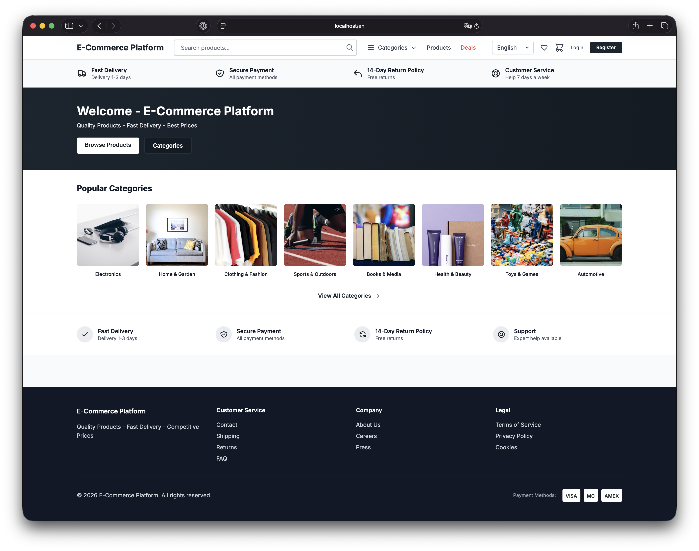
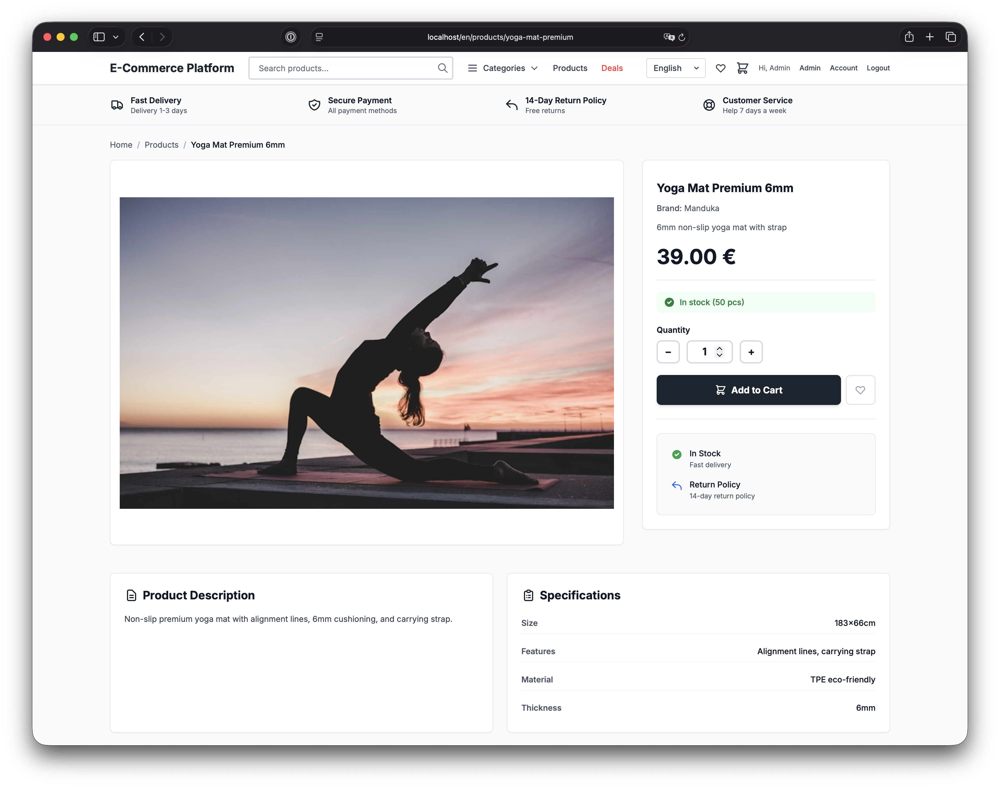
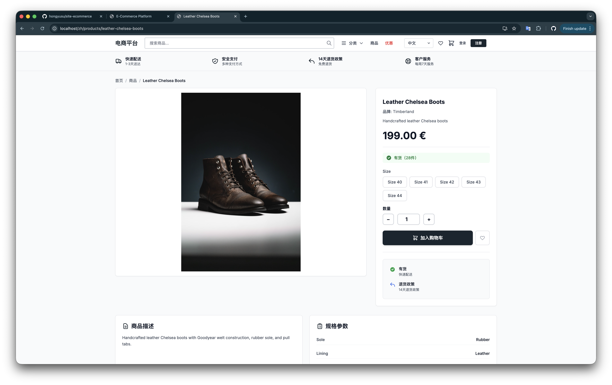
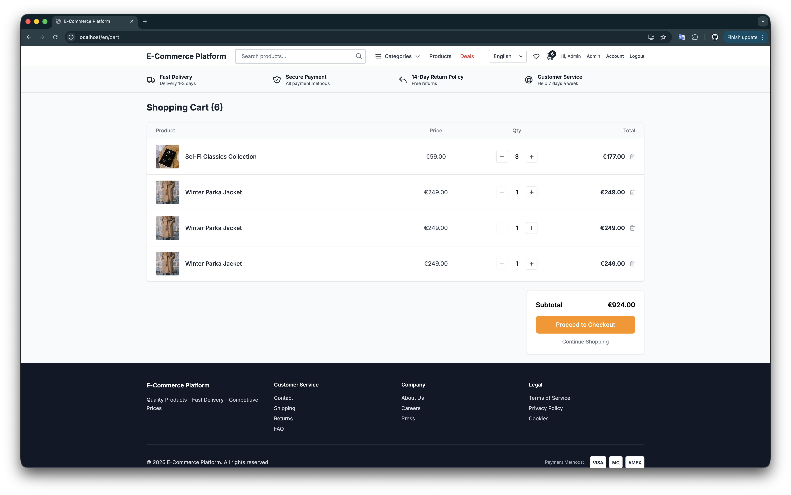
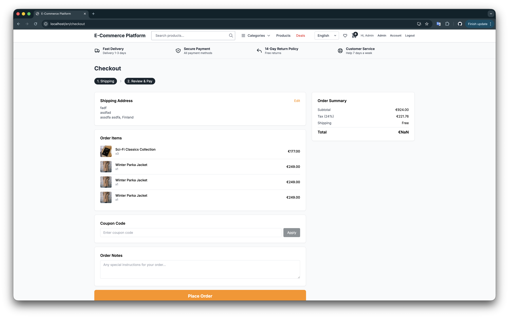
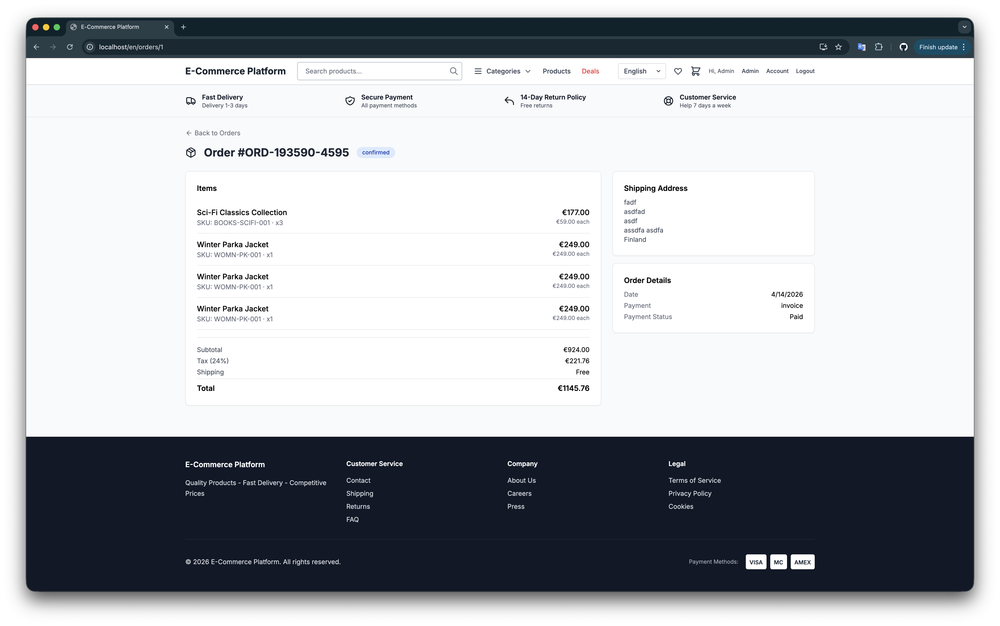
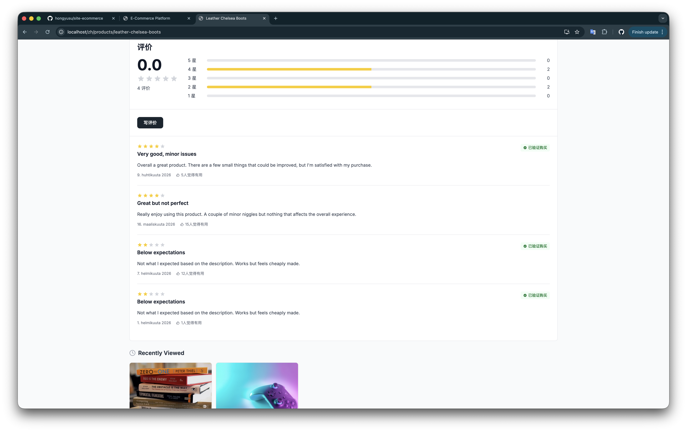
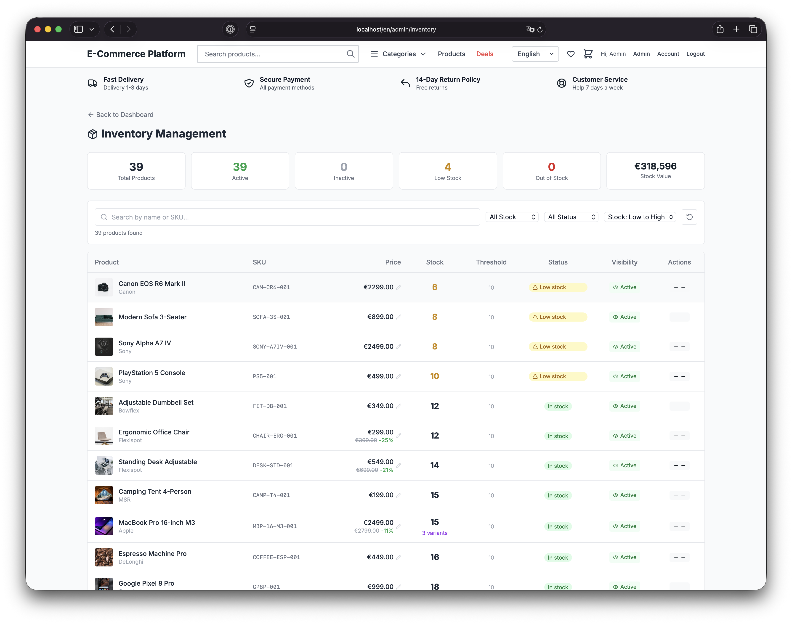
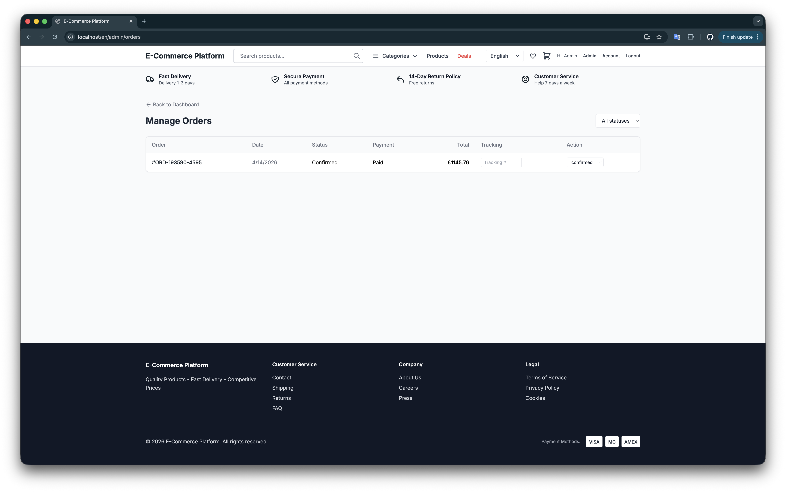
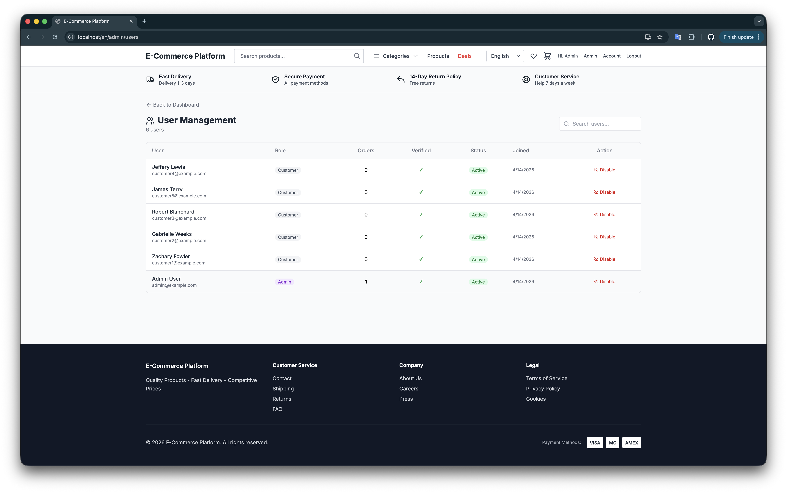

# E-Commerce Platform

Single-vendor B2C e-commerce platform built with Next.js 14, FastAPI, and PostgreSQL. Multi-language (Finnish, Swedish, English, Chinese), EUR-only, Europe-wide.

## Screenshots

### Storefront
| Homepage | Product Detail | Product Variants (Chinese) |
|----------|----------------|---------------------------|
|  |  |  |

### Shopping Flow
| Shopping Cart | Checkout | Order Detail |
|--------------|----------|-------------|
|  |  |  |

### Reviews & i18n
| Reviews (Chinese) |
|-------------------|
|  |

### Admin Panel
| Inventory Management | Order Management | User Management |
|---------------------|-----------------|----------------|
|  |  |  |

## Quick Start (All-in-One Docker)

```bash
docker build -f Dockerfile.allinone -t ecommerce-allinone .
docker run -d -p 80:80 --name ecommerce ecommerce-allinone
```

Open http://localhost — the database is auto-initialized with 39 products, 24 categories, and demo accounts.

**Demo Accounts:**
| Role | Email | Password |
|------|-------|----------|
| Admin | admin@example.com | admin123 |
| Customer | customer1@example.com | password123 |

## Architecture

```
┌────────────┐     ┌────────────┐     ┌────────────┐
│   Nginx    │────▶│  Next.js   │     │  FastAPI    │
│   :80      │     │  :3000     │     │  :8000      │
│            │────▶│            │────▶│             │
└────────────┘     └────────────┘     └──────┬──────┘
                                             │
                                    ┌────────┴────────┐
                                    │  PostgreSQL 15   │
                                    │  Redis 7         │
                                    └─────────────────┘
```

All services run in a single Docker container managed by supervisord.

## Tech Stack

| Layer | Technology |
|-------|-----------|
| Frontend | Next.js 14.2 (App Router), React 18, TypeScript 5, Tailwind CSS 3.4 |
| State | Zustand (client), React Query (server) |
| i18n | next-intl (FI/SV/EN with locale-prefixed routes) |
| Backend | Python 3.12, FastAPI 0.109, SQLAlchemy 2.0, Alembic |
| Auth | JWT (python-jose), bcrypt (passlib) |
| Database | PostgreSQL 15, Redis 7 |
| Email | Resend API (transactional emails) |
| Infrastructure | Docker, Nginx, supervisord |

## Features

### Customer
- Product catalog with 39 products across 24 categories
- Search with autocomplete, sort by price/name/rating, filter by price/stock
- Product variants (sizes, storage options) for 7 products
- Shopping cart with stock validation
- Multi-step checkout with address selection
- Coupon redemption (WELCOME10, SUMMER20, FREESHIP, SAVE50)
- Order confirmation emails (via Resend)
- Order history and public order tracking
- Wishlist (save for later)
- Product reviews (142 seeded reviews + write your own)
- User profile, address management, password change
- Email verification and password reset
- Deals & featured products page
- Recently viewed products
- Multi-language UI (Finnish, Swedish, English)
- Mobile responsive with hamburger menu
- PWA installable

### Admin
- Dashboard with KPIs and recent orders
- Product management (create, edit, delete)
- Inventory management (stock adjust, pricing, toggle active)
- Order management with status updates and tracking numbers
- Coupon management (create, edit, delete)
- Review moderation (view, filter, delete)
- User management (list, search, toggle active)
- Analytics (revenue, top products, order distribution)

## Project Structure

```
backend/
  app/
    api/v1/endpoints/     # 11 endpoint modules
      admin.py            # User management, analytics
      addresses.py        # Address CRUD
      auth.py             # Login, register, verify, reset
      cart.py             # Shopping cart
      categories.py       # Category CRUD
      coupons.py          # Coupon validation + CRUD
      inventory.py        # Stock management, pricing
      orders.py           # Order creation, tracking
      products.py         # Product CRUD, autocomplete, reviews
      reviews.py          # Admin review moderation
      wishlist.py         # Wishlist management
    core/                 # Config, database, security
    models/               # SQLAlchemy models (11 tables)
    schemas/              # Pydantic validation (7 schema files)
    services/email.py     # Resend email service
  alembic/                # Database migrations (5 versions)
  scripts/seed_data.py    # Demo data seeding

frontend/
  src/
    app/[locale]/         # 36 pages under locale routing
      admin/              # 8 admin pages
      products/           # Product list + detail
      cart/, checkout/    # Shopping flow
      profile/            # User profile + addresses + orders
      ...
    components/           # 14 reusable components
    store/                # 3 Zustand stores (auth, cart, wishlist)
    lib/api.ts            # Axios client with interceptors
    i18n.ts               # Internationalization config
  messages/               # Translation files (en.json, fi.json, sv.json)

docker-entrypoint.sh      # Auto-init: migrations + seed
supervisord.conf          # Process manager for all services
Dockerfile.allinone       # Single-container build
nginx/nginx.allinone.conf # Reverse proxy config
```

## API Endpoints

Base URL: `http://localhost/api/v1`

| Route | Methods | Auth | Description |
|-------|---------|------|-------------|
| /auth/register | POST | Public | Register user (sends verification email) |
| /auth/login | POST | Public | Login (returns JWT) |
| /auth/me | GET, PATCH | User | Get/update profile |
| /auth/change-password | POST | User | Change password |
| /auth/verify-email | POST | Public | Verify email with token |
| /auth/forgot-password | POST | Public | Send reset email |
| /auth/reset-password | POST | Public | Reset password with token |
| /products | GET | Public | List products (sort, filter, paginate) |
| /products/autocomplete | GET | Public | Search autocomplete (top 6) |
| /products/{id} | GET, POST, PATCH, DELETE | Mixed | Product CRUD |
| /products/{id}/reviews | GET, POST | Mixed | Product reviews |
| /categories | GET, POST, PATCH, DELETE | Mixed | Category CRUD |
| /cart | GET, DELETE | User | Get/clear cart |
| /cart/items | POST | User | Add to cart |
| /cart/items/{id} | PATCH, DELETE | User | Update/remove cart item |
| /addresses | GET, POST | User | List/create addresses |
| /addresses/{id} | GET, PATCH, DELETE | User | Address CRUD |
| /orders | GET, POST | User | List/create orders |
| /orders/track | GET | Public | Track order by number + email |
| /orders/{id} | GET | User | Order detail |
| /orders/admin | GET | Admin | List all orders |
| /orders/{id}/status | PATCH | Admin | Update order status/tracking |
| /inventory | GET | Admin | List inventory |
| /inventory/stats | GET | Admin | Inventory statistics |
| /inventory/{id}/stock | PATCH | Admin | Adjust stock (+/-) |
| /inventory/{id}/pricing | PATCH | Admin | Update pricing |
| /inventory/{id}/toggle-active | PATCH | Admin | Toggle product visibility |
| /coupons | GET, POST | Admin | List/create coupons |
| /coupons/validate | POST | User | Validate coupon code |
| /coupons/{id} | PATCH, DELETE | Admin | Update/delete coupon |
| /reviews | GET | Admin | List all reviews |
| /reviews/{id} | DELETE | Admin | Delete review |
| /wishlist | GET | User | List wishlist |
| /wishlist/{id} | POST, DELETE | User | Add/remove from wishlist |
| /admin/users | GET | Admin | List users |
| /admin/users/{id}/toggle-active | PATCH | Admin | Toggle user active |
| /admin/analytics | GET | Admin | Revenue, top products, trends |

## Database Schema

11 tables: `users`, `categories`, `products`, `product_images`, `product_variants`, `product_reviews`, `carts`, `cart_items`, `orders`, `order_items`, `addresses`, `coupons`, `wishlist_items`

## Seed Data

On first boot, the entrypoint automatically creates:
- 6 users (1 admin + 5 customers)
- 24 categories (8 top-level + 16 subcategories)
- 39 products with images, specs, and brands
- 29 product variants (sizes, storage options)
- 142 reviews with ratings
- 4 coupons (WELCOME10, SUMMER20, FREESHIP, SAVE50)

## Development

### Local (without Docker)
```bash
# Backend
cd backend
poetry install
poetry run alembic upgrade head
poetry run python scripts/seed_data.py
poetry run uvicorn app.main:app --reload  # http://localhost:8000

# Frontend
cd frontend
npm install
npm run dev  # http://localhost:3000
```

### Docker (all-in-one)
```bash
docker build -f Dockerfile.allinone -t ecommerce-allinone .
docker run -d -p 80:80 --name ecommerce ecommerce-allinone

# With persistent data
docker run -d -p 80:80 \
  -v ecommerce-pgdata:/var/lib/postgresql/15/main \
  -v ecommerce-redis:/var/lib/redis \
  ecommerce-allinone
```

## Environment Variables

| Variable | Default | Description |
|----------|---------|-------------|
| DATABASE_URL | postgresql://postgres@localhost:5432/ecommerce_dev | PostgreSQL connection |
| REDIS_URL | redis://localhost:6379/0 | Redis connection |
| JWT_SECRET | dev-secret-key-change-in-production | JWT signing key |
| RESEND_API_KEY | (empty = console mode) | Resend API key for emails |
| EMAIL_FROM | onboarding@resend.dev | Sender email address |
| FRONTEND_URL | http://localhost | Base URL for email links |
| CORS_ORIGINS | http://localhost:3000 | Allowed CORS origins |

## Credentials & Secrets

**No secrets are committed to the repository.** The following credentials need to be configured:

### Demo Accounts (seeded automatically)

| Role | Email | Password |
|------|-------|----------|
| Admin | admin@example.com | admin123 |
| Customer 1-5 | customer{1-5}@example.com | password123 |

### API Keys & Secrets

| Secret | Where to set | How to get |
|--------|-------------|------------|
| `RESEND_API_KEY` | `backend/.env.dev` or `supervisord.conf` | Sign up at [resend.com](https://resend.com), get API key from dashboard |
| `JWT_SECRET` | `backend/.env.dev` or `supervisord.conf` | Any random string (min 32 chars). Default dev key is pre-set. |

### Email Configuration

- **Without Resend API key**: Emails print to backend console logs (verification links, password resets, order confirmations all visible in `docker logs`)
- **With Resend API key**: Real emails sent via Resend. Free tier: 100 emails/day
- **Sender address**: Uses `onboarding@resend.dev` (Resend's shared test domain). To send from your own domain, verify it in Resend dashboard.

### Setting up credentials

**For all-in-one Docker**, edit these files before building:
```bash
# Option 1: Edit .env.dev (loaded by backend)
backend/.env.dev → RESEND_API_KEY=re_your_key_here

# Option 2: Edit supervisord.conf (Docker environment)
supervisord.conf → RESEND_API_KEY="re_your_key_here"
```

**For docker-compose**, set environment variables:
```bash
export RESEND_API_KEY=re_your_key_here
docker-compose up
```

### Security Notes

- The `JWT_SECRET` default value is for development only. Change it for any public deployment.
- `backend/.env.dev` is committed with empty API keys. Never commit real secrets.
- `.env.local`, `.env.production`, and `.claude/` are in `.gitignore`.
- Demo user passwords are weak by design — change them for production.

## License

MIT
