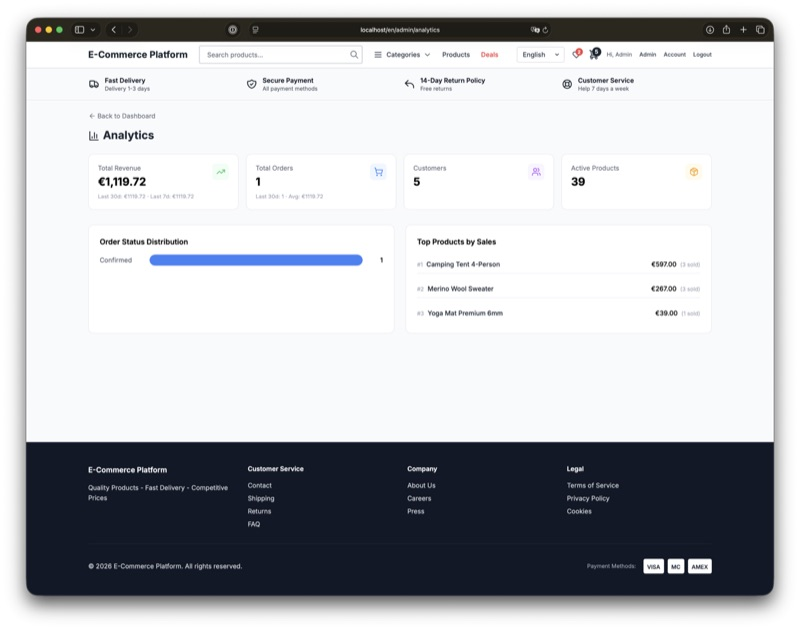
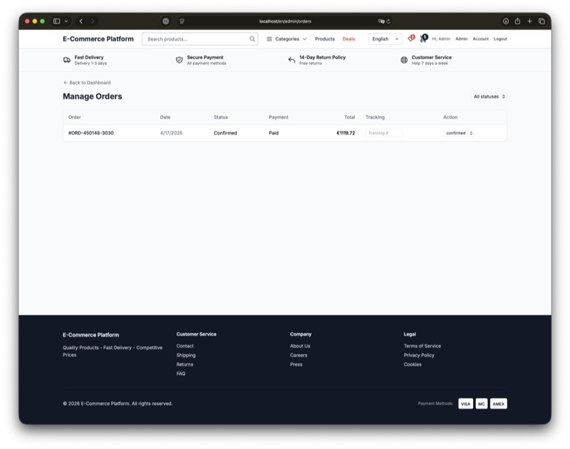
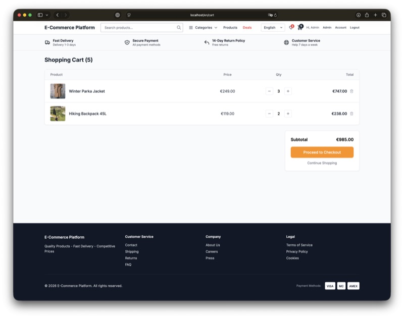
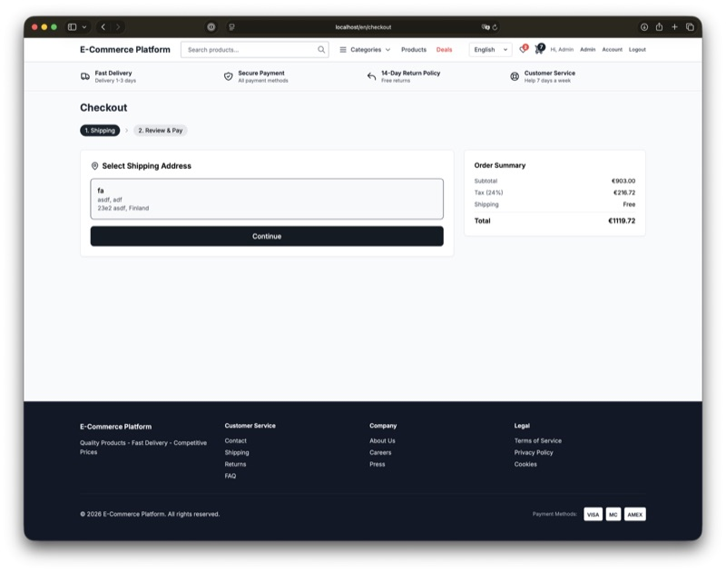
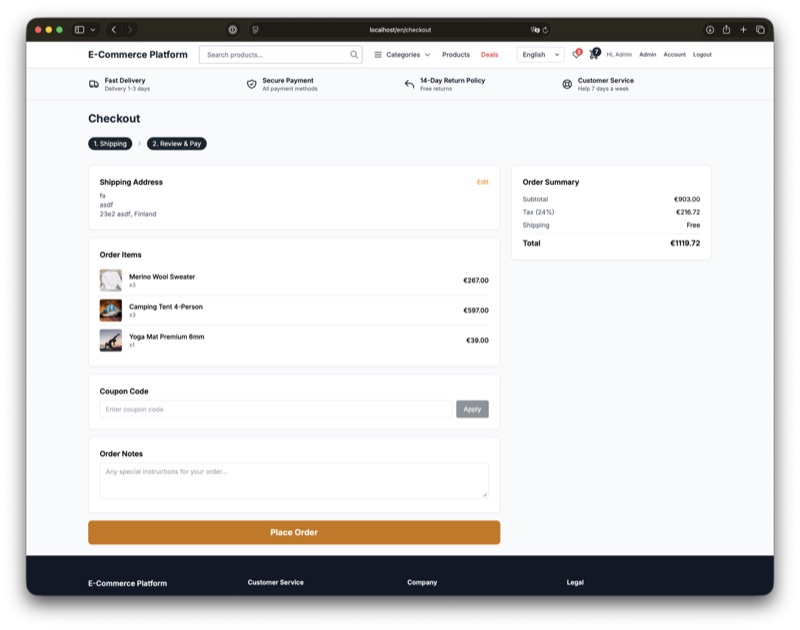
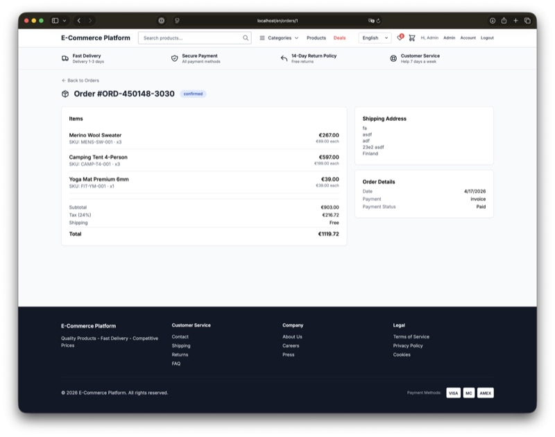
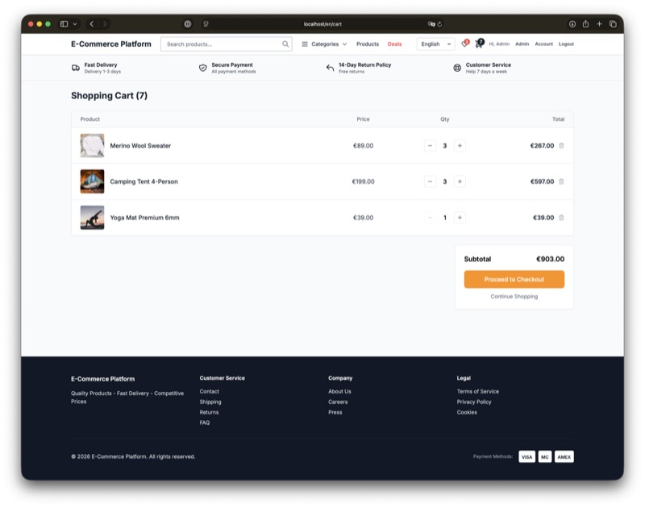
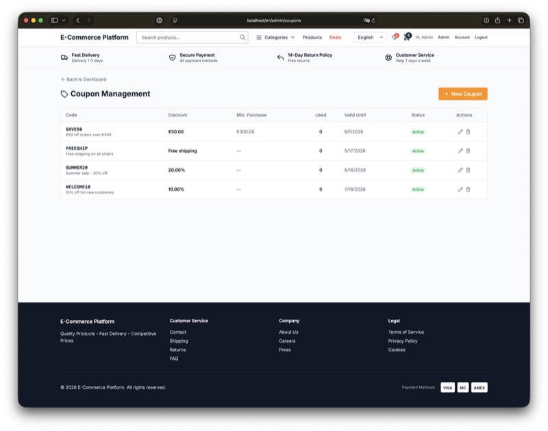
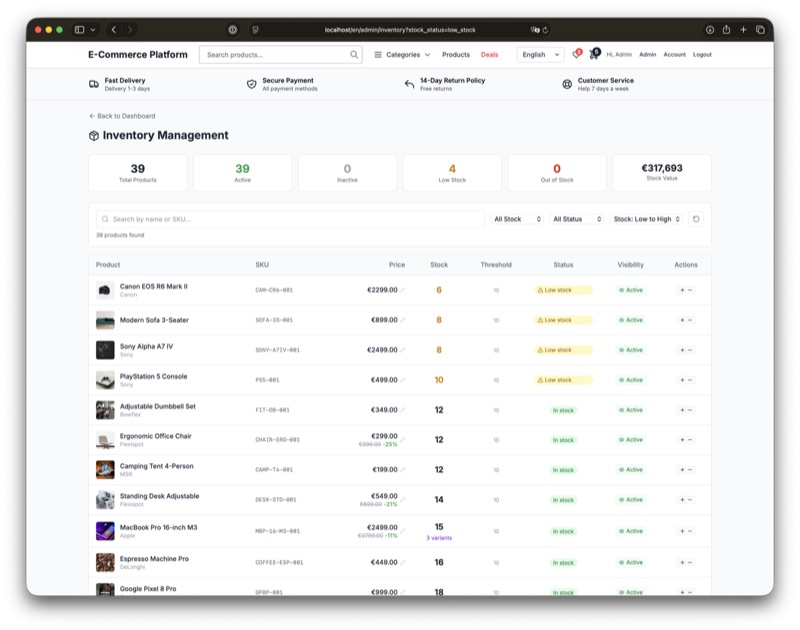
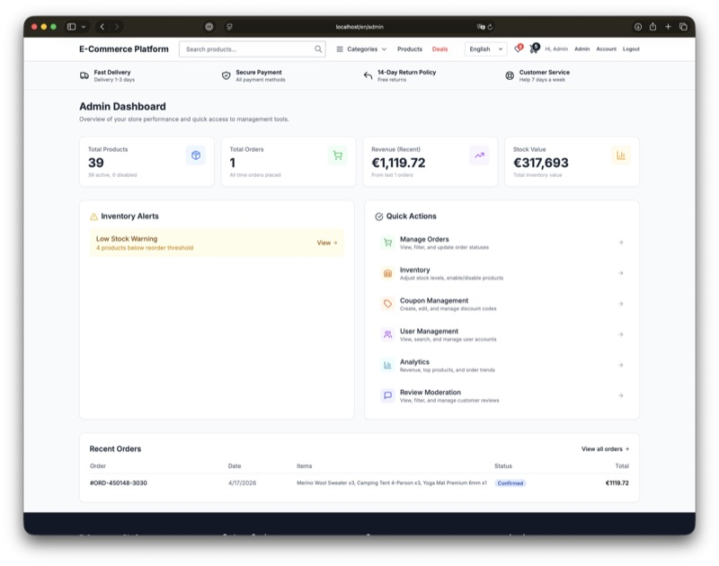

# Mall & More

A single-vendor B2C e-commerce platform built with FastAPI and Next.js. Product catalog, cart, checkout, orders, admin panel. Multi-language (FI/SV/EN/ZH), EUR only.

**Live Demo:** http://178.104.206.21:8081

| Role     | Email                     | Password    |
|----------|---------------------------|-------------|
| Admin    | admin@example.com         | admin123    |
| Customer | customer1@example.com     | password123 |

## Screenshots

### Storefront
| Homepage | Product Detail | Product Variants (Chinese) |
|----------|----------------|---------------------------|
|  |  |  |

### Shopping Flow
| Shopping Cart | Checkout | Order Detail |
|--------------|----------|-------------|
|  |  |  |

### Reviews & i18n
| Reviews (Chinese) |
|-------------------|
|  |

### Admin Panel
| Inventory Management | Order Management | User Management |
|---------------------|-----------------|----------------|
|  |  |  |

## Quick Start

```bash
docker build -f Dockerfile.allinone -t ecommerce-allinone .
docker run -d -p 80:80 --name ecommerce ecommerce-allinone
```

Database auto-initializes with 39 products, 24 categories, and demo accounts on first startup.

For multi-container development with hot reload:
```bash
docker compose up --build
```

### Demo Accounts

| Role     | Email                     | Password    |
|----------|---------------------------|-------------|
| Admin    | admin@example.com         | admin123    |
| Customer | customer1@example.com     | password123 |

**Access Points:**
- Frontend: http://localhost
- API Docs: http://localhost/docs
- Admin Panel: http://localhost/en/admin

## Tech Stack

| Layer | Technology |
|-------|-----------|
| Frontend | Next.js 14 (App Router), TypeScript 5, Tailwind CSS 3.4 |
| State | Zustand, React Query, Axios |
| i18n | next-intl (FI/SV/EN with locale-prefixed routes) |
| Backend | FastAPI 0.109, Python 3.12, SQLAlchemy 2.0, Pydantic v2 |
| Database | PostgreSQL 15, Redis 7 |
| Auth | JWT (python-jose), bcrypt, role-based access |
| Email | Resend API (falls back to console logging) |
| Infra | Docker, Nginx, supervisord (all-in-one) or Docker Compose (multi-container) |

## Features

### Customer
- Product catalog with search, autocomplete, sort, and price/stock filters
- Product variants (sizes, storage options), reviews, wishlist
- Shopping cart with stock validation, multi-step checkout
- Coupon codes (WELCOME10, SUMMER20, FREESHIP, SAVE50)
- Order history, public order tracking, email confirmations
- User profile, address management, password reset
- Multi-language UI, mobile responsive, PWA installable

### Admin
- Dashboard with KPIs, revenue analytics, top products
- Product, category, and inventory management
- Order management with status updates and tracking numbers
- Coupon management, review moderation, user management

## Architecture

```
Browser  ->  Nginx (:80)  ->  Next.js (:3000)   # Frontend
                           ->  FastAPI (:8000)   # Backend API
                                   |
                              PostgreSQL (:5432)
                              Redis (:6379)
```

All-in-one mode runs everything in a single container via supervisord.

## Project Structure

```
site-ecommerce/
├── backend/
│   ├── app/
│   │   ├── api/v1/endpoints/   # 12 endpoint modules
│   │   ├── models/             # 12 SQLAlchemy models
│   │   ├── schemas/            # 7 Pydantic schema files
│   │   ├── core/               # Config, database, security
│   │   └── services/email.py   # Resend email service
│   ├── alembic/                # Database migrations
│   └── scripts/seed_data.py    # Demo data seeding
├── frontend/
│   ├── src/app/[locale]/       # 36 pages under locale routing
│   ├── src/components/         # 14 reusable components
│   ├── src/store/              # Zustand stores (auth, cart, wishlist)
│   ├── src/lib/api.ts          # Axios client with interceptors
│   └── messages/               # Translation files (en, fi, sv)
├── docker-compose.yml          # Multi-container dev setup
├── Dockerfile.allinone         # Single-container build
├── supervisord.conf            # Process manager config
└── nginx/                      # Reverse proxy configs
```

## Database

13 tables. Key entities: `users`, `products`, `categories`, `product_variants`, `product_reviews`, `carts`, `cart_items`, `orders`, `order_items`, `addresses`, `coupons`, `wishlist_items`, `product_images`.

**Seed data:** 6 users, 24 categories, 39 products, 29 variants, 142 reviews, 4 coupons.

## API Endpoints (40+)

| Module | Endpoints | Key Routes |
|--------|-----------|------------|
| Auth | 7 | register, login, me, change-password, verify-email, forgot/reset-password |
| Products | 5 | list, autocomplete, CRUD, reviews |
| Categories | 4 | list, create, update, delete |
| Cart | 5 | get, clear, add, update, remove items |
| Orders | 5 | create, list, detail, track, admin status update |
| Addresses | 5 | list, create, get, update, delete |
| Inventory | 5 | list, stats, adjust stock, pricing, toggle active |
| Coupons | 5 | list, create, update, delete, validate |
| Reviews | 2 | list (admin), delete (admin) |
| Wishlist | 3 | list, add, remove |
| Variants | 3 | list, create, update variant options |
| Admin | 3 | users, toggle user active, analytics |

Full API documentation at `/docs` (Swagger UI).

## Deployment

```bash
# All-in-one Docker (production/demo)
docker build -f Dockerfile.allinone -t ecommerce-allinone .
docker run -d -p 80:80 ecommerce-allinone

# With persistent data
docker run -d -p 80:80 \
  -v ecommerce-pgdata:/var/lib/postgresql/15/main \
  -v ecommerce-redis:/var/lib/redis \
  ecommerce-allinone

# Multi-container (development)
docker compose up --build
```

Environment variables (`DATABASE_URL`, `REDIS_URL`, `JWT_SECRET`, `RESEND_API_KEY`) have sensible defaults for local development. No `.env` configuration required for demo.

Built with [FastAPI](https://fastapi.tiangolo.com/) and [Next.js](https://nextjs.org/)
